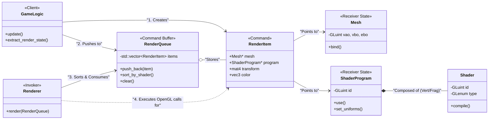
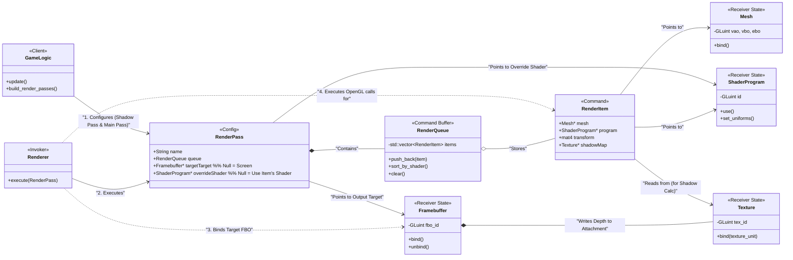
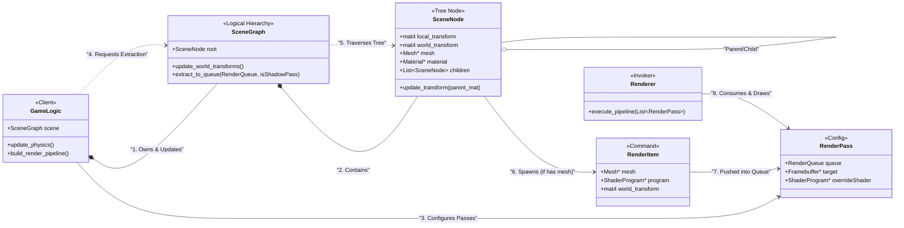

# Architecture

An experimental architecture diagrams for rendering.

## One pass rendering

### How this maps to the Command Pattern

While a traditional Gang of Four Command Pattern uses a virtual `execute()` method on a base class, graphics programming modifies this slightly for performance (to keep data contiguous in memory with `std::vector`).

1. **The Client (`GameLogic`):** Instead of calling `glDrawElements` directly, it packages all the information needed to draw an object into a `RenderItem` struct.
2. **The Command (`RenderItem`):** This is a purely data-driven command. It says, "I need _this_ mesh drawn with _this_ shader at _this_ location."
3. **The Invoker (`Renderer`):** It takes the `RenderQueue` (a buffer of commands). Crucially, because the commands are just data, the Invoker can **sort them** before executing them, which is how you save performance by minimizing shader swaps.
4. **The Receivers (`Mesh` & `ShaderProgram`):** These hold the actual OpenGL IDs. The Renderer extracts these pointers from the Command and executes the raw state changes (`glBindVertexArray`, `glUseProgram`).

## Include multi pass rendering

### What changed and why

1. **The `RenderPass` Class:** This is the most crucial addition. Instead of passing a raw `RenderQueue` to the Renderer, `GameLogic` now passes a `RenderPass`.
   - **Pass 1 (Shadows):** `targetTarget` is set to your Shadow Map FBO. `overrideShader` is set to your simple depth-calculation shader.
   - **Pass 2 (Main Screen):** `targetTarget` is null (draws to screen). `overrideShader` is null (tells the Renderer to use the specific `ShaderProgram` attached to each `RenderItem`).
2. **`Framebuffer` and `Texture` Classes:** These represent your new GPU resources. The Shadow Pass writes depth data into the `Framebuffer`, which is physically stored in a `Texture`.
3. **The Loopback:** Notice how the `Framebuffer` writes to a `Texture`, and the `RenderItem` (during the Main Pass) reads from that exact same `Texture` to calculate whether a pixel is in shadow.

## Process scene graph before assembling a render queue

